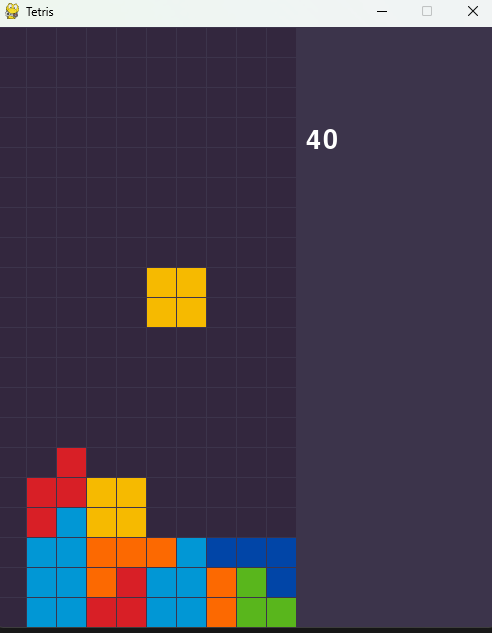

# NEAT Tetris Python
A Python project that creates Tetris using the pygame library and uses the NEAT-Python library to create a Tetris AI. The AI is trained by checking each possible move that can be made given the current board and current piece. The boards that result from each possible move are then analyzed for specific features. In my project these features are changes in hole count, lines cleared, lowest y coordinate of the tetromino placed, change in column height differential, change in aggregate height, and change in number of wells. These features then act as the input to the neural network and the move with the highest output is selected. The fitness function is simply the number of lines cleared by the genome. 

This project was developed to learn about creating game logic and to practice training and creating AIs for video games.

 ## Results
 After training for 30 generations the best genome is saved as best.pickle. After testing, the genome was able to consistently clear 300 lines. Due to the randomness of pieces, the AI can sometimes face a series of difficult pieces that results in an early top-out. 
 
 ## Features
 -  Visualized AI Training 
 -  Visualized AI Testing 
 -  Adjustable Parameters 
 -  Functional Tetris Game with Line Clear Counter 

## Installation
To use this project you will need to have python installed. It is recommended that you set up a virtual environment. After this you can clone the repository and install the dependencies using the requirements.txt file. After this you can run main.py

## Usage
Using this project is simple. Within the "if __name__ == '__main__':" block of code, you will find two lines of code. There is a run_neat(config) and a test_ai(config) line. Simply comment out one of these lines depending on if you want to train or test the ai. Testing the ai will load the best.pickle file that is produced from training the AI. If you want to customize the training, changes can be made to the config.txt file. For details on how to do this check the NEAT-Python documentation.

## Takeaways
This project taught me the importance extracting useful features. If the data that you are putting into training is subpar you will get subpar result. It is very important to understand what the data is saying and think about what features are important for the AI to understand how to differentiate a good move from a bad move. Another useful takeaway was understanding the optimizations that can be made when training an AI. There were many times when slight changes can make a large impact on performance . There were also times when making huge changes can hardly impact performance but largely impact training time. Understanding these tradeoffs is very useful for creating a well optimized AI. 

If I wanted to improve this project, I would likely change the fitness function to be more than just lines cleared. I would also improve the move selection to make use of next piece information and allow for more complicated Tetris moves such as tucks and spins. This would likely greatly improve the AI's performance and  help prevent early top outs from bad piece rng.

 ## Libraries
 - Pygame under the LGPL License 
 - NEAT-python under the BSD-3 Clause License

